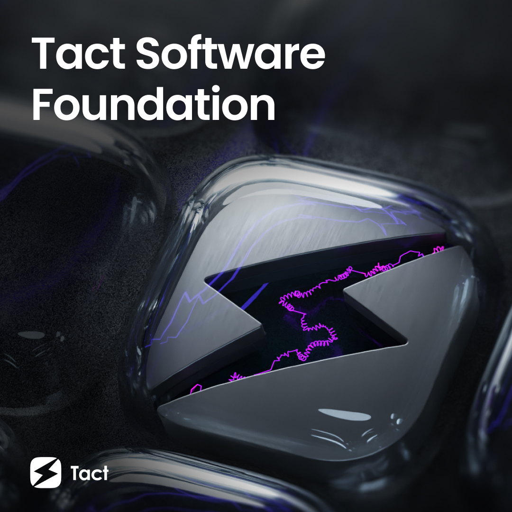

<!-- omit from toc -->

# Awesome Tact 

A curated list of resources designed to help you learn and program in Tact.

---

<!-- omit from toc -->

## 📖 Table of Contents

- [📚 Official Resources](#-official-resources)
- [🎤 Blog Posts](#-blog-posts)
- [🎓 Education](#-education)
- [🎯 Get Coding in Tact](#-get-coding-in-tact)
  - [Developer Tools](#developer-tools)
  - [Templates](#templates)
  - [Libraries](#libraries)
- [📜 Smart Contracts Examples](#-smart-contracts-examples)
- [Contribution Guidelines](#contribution-guidelines)
- [License](#license)

---

## 📚 Official Resources

- [Tact Documentation](https://tact-lang.org/)
- [Tact on GitHub](https://github.com/tact-lang/tact)
- [Tact Community on Telegram](https://t.me/tactlang)
- [Learn with Tact by Example](https://tact-by-example.org/)
- [Get Started with Tact Project Template](https://github.com/tact-lang/tact-template)

## 🎤 Blog Posts

- [The Story of Tact](https://blog.ton.org/the-story-of-tact)

## 🎓 Education

### Basics

- [Introduction to Blockchain](https://blog.ton.org/what-is-blockchain)
- [The Open Network](https://docs.ton.org/learn/introduction)

### YouTube Educational Videos

- [Tact & Blueprint [EN]](https://www.youtube.com/@AlefmanVladimirEN-xb4pq/videos) by [@alefman](https://t.me/alefman)
- [Tact & Blueprint [RU]](https://www.youtube.com/watch?v=isYBvzM-MfQ&list=PLOIvUFGfwP93tZI_WnaLyJsZlskU4ao92) by [@alefman](https://t.me/alefman)
- [Tact development [RU]](https://www.youtube.com/watch?v=S6wlNsKUHpE&list=PLyDBPwv9EPsAJpR7R0cC4kgo7BjiMmUy7&index=1) by [@nonam3e](https://t.me/nonam3e)
- [TON 开发从入门到应用 [CN]](https://openbuild.xyz/learn/challenges/2023609337/2939) by Jason
- [Tact & TON Basic 手把手學習 [CN]](https://www.youtube.com/@ton101_zh) by [@howard_peng](https://t.me/ton101_zh)

## 🎯 Get Coding in Tact

### Developer Tools

Editors and IDEs:
- [Visual Studio Code: Extension for Tact](https://marketplace.visualstudio.com/items?itemName=KonVik.tact-lang-vscode)
- [JetBrains IDEs: TON plugin for Tact](https://plugins.jetbrains.com/plugin/23382-ton)
- [Vim 8+: plugin for Tact](https://github.com/tact-lang/tact.vim)
- [Nujan Web-based IDE](https://ide.nujan.io)

Language Tools:
- [Tact Language Server, extracted from official VSCode extension](https://github.com/novusnota/tact-extracted-ls)

Grammars:
- [🌳 Tree-sitter grammar for the ⚡ Tact contract programming language](https://github.com/tact-lang/tree-sitter-tact)
- [highlight.js-based grammar for Tact](https://github.com/bakkenbaeck/highlightjs-tact): provides syntax highlighting for Tact
- [Prism.js grammar for Tact](https://github.com/novusnota/prism-ton/blob/main/langs/prism-tact.js): provides syntax highlighting for Tact

### Templates

- [Tact Template](https://github.com/tact-lang/tact-template): A ready-to-use Tact compiler with TypeScript + Jest and a Tact emulator. Includes examples of how to perform tests.

### Libraries

- [Blueprint](https://github.com/ton-community/blueprint): A development environment for TON Blockchain to write, test, and deploy smart contracts.
- [Tact Emulator](https://github.com/tact-lang/tact-emulator): An emulation toolkit for TON Smart Contracts.
- [TON Contract DNS](https://github.com/tact-lang/ton-contract-dns): A small library for resolving TON DNS names.
- [TON Jest](https://github.com/tact-lang/ton-jest): Testing tools for TON and Jest.
- [Tact Deployer](https://github.com/tact-lang/tact-deployer): A library to prepare the deployment of a Tact package.

## 📜 Smart Contracts Examples

- [Tact Wallet Contract](https://github.com/tact-lang/contract-wallet): This wallet contract supports gasless transactions, allows operations on behalf of the wallet by other contracts, and can execute a scalable number of operations in a single transaction.
- [Tact Payouts Contract](https://github.com/tact-lang/contract-payouts): A perfect solution for on-chain payouts. This contract generates a list of text tickets for each address entitled to a payout. Tickets are signed transactions serialized as comments to be parsed by the smart contract.
- [TON VOTE Contracts](https://github.com/orbs-network/ton-vote-contracts/tree/main): TON Blockchain smart contracts for [ton.vote](https://ton.vote/)
- [Simple DNS Contract](https://github.com/tact-lang/contract-dns-simple): A contract that allows you to manage DNS records in a simple way. It also allows to burn fuses disallowing certain modifications of records.
- [NFT Standard Example](https://github.com/howardpen9/nft-template-in-tact): A basic implementation of NFT standard that include the [TEP-62](https://github.com/ton-blockchain/TEPs/blob/master/text/0062-nft-standard.md) and [TEP-66](https://github.com/ton-blockchain/TEPs/blob/master/text/0066-nft-royalty-standard.md) in practice. Contributed by community contributor [@howard_peng9](https://dune.com/Howard_Peng)
- [Jetton Standard Example](https://github.com/howardpen9/jetton-implementation-in-tact): Followed the [TEP-74](https://github.com/ton-blockchain/TEPs/blob/master/text/0074-jettons-standard.md), contributed by [@howard_peng9](https://github.com/howardpen9).
- [Jetton Token Launchpad](https://github.com/microcosm-labs/tonup-contracts): Jetton Token launch platform that built by [TonUp.io](https://tonup.io) Team.
- [TonDynasty](https://github.com/Ton-Dynasty/tondynasty-contracts): Ton Dynasty Contract is a library for efficient smart contract development by tact-lang. Provide series of template for ton developers to utilize.
  Ton Dynasty will always stand by you. Ask for our help in [Ton Dynasty Community](https://t.me/ton_dynasty_community).
- [Fireworks](https://github.com/ton-community/tact-fireworks): An educational contract for learning basic tools in tact and writing tests for special cases.

- [More Examples](https://github.com/tact-lang/tact/tree/main/examples): Check out 10+ examples in the official Tact repository.

## Contribution Guidelines

1. Decide on the changes you want to make in the awesome-ton list.
2. Press `.` on the `awesome-tact` page to open the online editor (VSCode).
3. Make changes, describe them, and submit a commit as a Pull Request.
4. Congratulations, you're now a contributor to TON! 😎

## License

MIT
